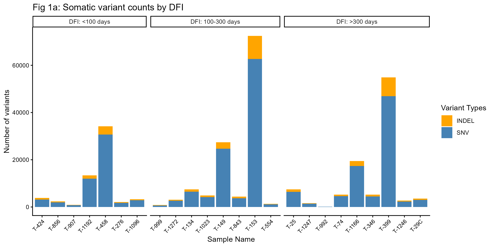
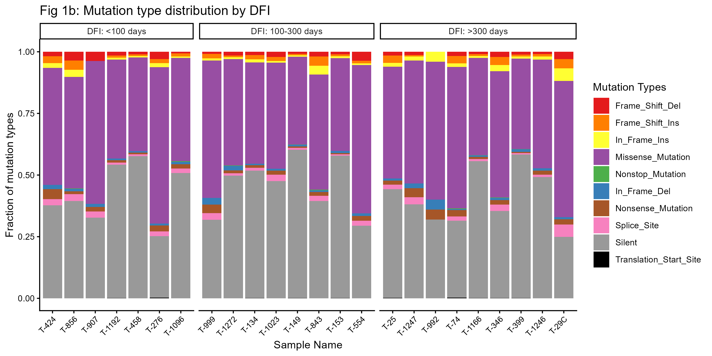
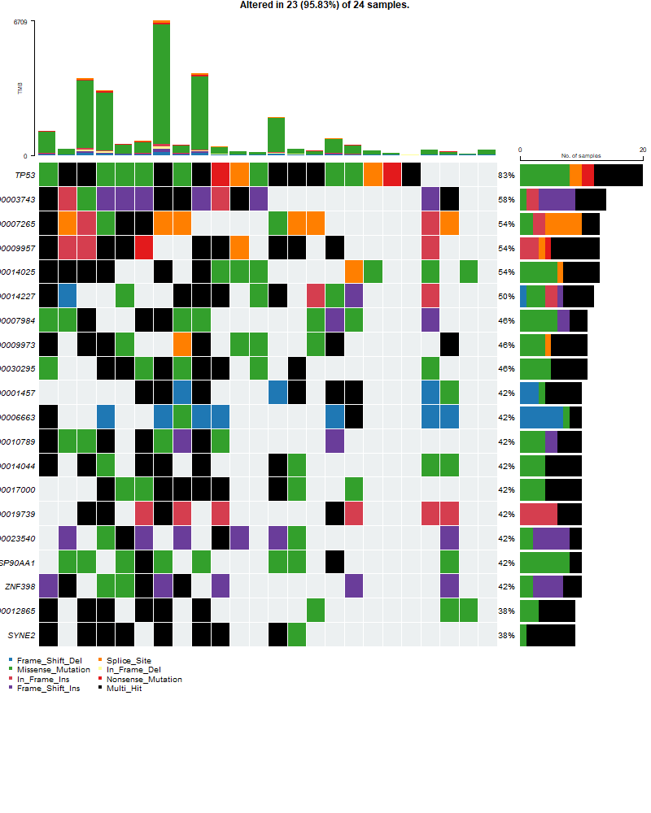
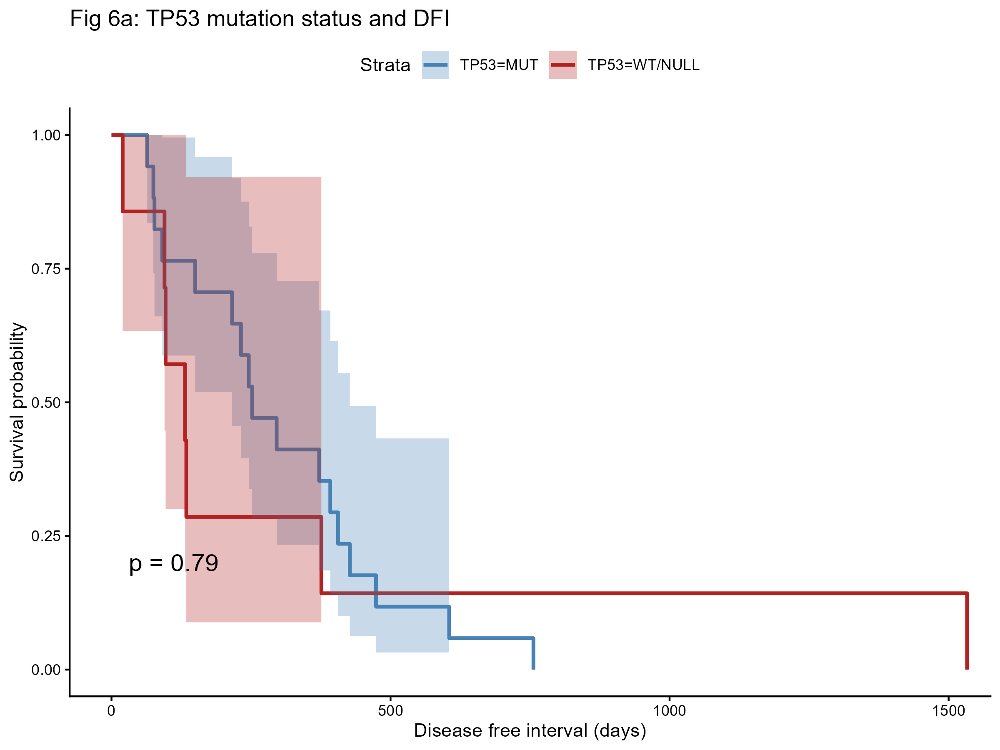

# ISG5312 Final Project
## Somatic Variant Calling in Canine Osteosarcoma
### Reproduction of Das et al. (2021)

**Student:** Stephanie Ballas  
**Repository:** stephanieballas/ISG5312FinalProject  
**Cluster:** UConn Xanadu HPC  

---

## Overview

This project is a conceptual reproduction of Das et al. (2021), a whole exome sequencing (WES) study of 26 paired tumor-normal canine osteosarcoma samples. The pipeline follows GATK best practices for somatic variant discovery, from raw FASTQ files through functional annotation and downstream analysis. Four figures from the original paper were reproduced: Fig 1a (variant counts by DFI), Fig 1b (mutation type distribution), Fig 2a (oncoprint of top mutated genes), and Fig 6a (Kaplan-Meier survival analysis by TP53 mutation status).

---

## Introduction

This project is a conceptual reproduction of Das et al. (2021), a whole exome sequencing (WES) study of canine osteosarcoma. The original paper identifies recurrent somatic mutations across 26 paired tumor-normal samples and finds that TP53 missense mutations and immune pathway enrichment are associated with longer patient survival.

This pipeline re-analyzes the same publicly available raw sequencing data, following GATK best practices for somatic short variant discovery, from raw FASTQ files through to functionally annotated variants.

> **Note:** This project was originally planned around a human glioblastoma dataset, but that dataset required dbGaP controlled access. After failing to identify a suitable publicly available human WES dataset, the project was redirected to this canine osteosarcoma WES dataset, which is fully public and well-documented.

---

## Reproduction Targets

- Somatic SNV and indel calling across 26 matched tumor-normal WES pairs
- Identification of recurrently mutated genes (especially TP53 and SETD2)
- Mutation frequency summary and oncoprint visualization
- TP53 mutation status comparison across samples and association with disease-free interval

---

## Dataset

| Feature | Details |
|---|---|
| Species | Canis lupus familiaris (dog) |
| Tissue | Osteosarcoma tumor + matched peripheral blood/stroma normal |
| Sequencing | Paired-end WES, 151 bp, Illumina HiSeq 4000 |
| Tumor samples | 27 samples — BioProject PRJNA613479 (SRR11352506–SRR11352532) |
| Normal samples | 26 samples — BioProject PRJNA503860 (SRR11392157–SRR11392182, excluding SRR11392176) |
| Tumor-normal pairs analyzed | 24 (see Limitations) |
| Reference genome | CanFam3.1 (Ensembl release 104) |

---

## Repository Structure

```
ISG5312FinalProject/
├── README.md
├── .gitignore
├── scripts/
│   ├── 01_download/
│   │   └── 01_download_fastq.sh              # SRA Toolkit prefetch + fasterq-dump
│   ├── 02_qc/
│   │   ├── 01_fastqc_raw.sh                  # FastQC on raw FASTQs (array job)
│   │   ├── 02_multiqc_raw.sh                 # MultiQC pre-trim summary
│   │   ├── 03_trimmomatic.sh                 # Adapter + quality trimming (array job)
│   │   ├── 03b_retrim_SRR11352519.sh         # Re-trim for truncated sample
│   │   ├── 04_fastqc_trimmed.sh              # FastQC on trimmed FASTQs (array job)
│   │   └── 05_multiqc_trimmed.sh             # MultiQC post-trim summary
│   ├── 03_alignment/
│   │   ├── 01_bwa_index.sh                   # Index CanFam3.1 reference genome
│   │   └── 02_bwa_align.sh                   # BWA-MEM alignment + MarkDuplicates (array job, %6)
│   ├── 04_alignQC/
│   │   └── 01_alignQC.sh                     # samtools flagstat + MultiQC
│   ├── 05_variantCalling/
│   │   ├── tumor_normal_pairs.txt            # 26 tumor-normal pair mappings (SRR IDs)
│   │   ├── 01_mutect2.sh                     # GATK Mutect2 paired mode (array job, %4)
│   │   ├── 01_mutect2_rerun_timeouts.sh      # Rerun of 6 pairs that exceeded 24hr wall time
│   │   ├── 02_mutect2_rerun_f1r2.sh          # Rerun of 8 pairs missing f1r2 output
│   │   ├── 03_mutect2_rerun_520.sh           # 72hr rerun for SRR11352520 (timed out)
│   │   └── 04_mutect2_rerun_532.sh           # 72hr rerun for SRR11352532 (timed out)
│   ├── 06_filteringAnnotating/
│   │   └── 01_filter_mutect.sh               # LearnReadOrientationModel + FilterMutectCalls + SelectVariants
│   ├── 07_annotation/
│   │   └── 01_snpeff.sh                      # SnpEff annotation (CanFam3.1.86 database)
│   └── 08_analysis/
│       ├── 01_parse_snpeff.py                # Parse SnpEff annotated VCFs to TSV
│       └── analysis.R                        # R script for all figures
├── resources/
│   ├── SRR_to_TID_mapping.txt               # SRR accession to tumor ID mapping
│   ├── SRR_normals_mapping.txt              # SRR accession to normal ID mapping
│   └── sample_metadata.txt                  # Sample metadata with DFI and clinical data
└── results/
    ├── 02_qc/
    │   ├── fastqc_raw/                       # Per-sample raw FastQC HTML reports
    │   ├── multiqc_raw/                      # Aggregated pre-trim MultiQC report
    │   ├── fastqc_trimmed/                   # Per-sample trimmed FastQC HTML reports
    │   └── multiqc_trimmed/                  # Aggregated post-trim MultiQC report
    ├── 04_alignQC/
    │   └── samstats/                         # Per-sample flagstat outputs + MultiQC report
    ├── 05_variantCalling/
    │   └── mutect2/                          # Per-pair unfiltered VCFs + f1r2 tar.gz files
    ├── 06_filteringAnnotating/               # Filtered VCFs and PASS-only VCFs
    ├── 07_annotation/
    │   └── snpeff/                           # Per-pair SnpEff HTML stats and genes files
    └── 08_analysis/
        ├── all_variants_annotated.tsv        # Parsed variant table (282k variants)
        ├── fig1a_variant_counts.png          # Fig 1a reproduction
        ├── fig1b_mutation_types.png          # Fig 1b reproduction
        ├── fig2a_oncoprint.png               # Fig 2a reproduction
        └── fig6a_KM_TP53_status.png          # Fig 6a reproduction
```

> **Note:** Large files (FASTQs, BAMs, VCF.gz, genome files) are excluded from git via .gitignore. Only scripts, summary reports, and text-based results are tracked.

---

## Methods
### Step 1 — Data Download
Raw FASTQ files were downloaded from NCBI SRA using SRA Toolkit for all 53 samples across both BioProjects.
```bash
prefetch ${SRR}
fasterq-dump --split-files ${SRR}
```
**Tools:** SRA Toolkit 3.0.5  
**Script:** scripts/01_download/01_download_fastq.sh

---

### Step 2 — Quality Control and Trimming

Pre-trimming FastQC was run on all 53 samples (27 tumor + 26 normal). Key observations:
- All samples: 151 bp paired-end reads
- Raw read counts: ~98M–181M reads per sample
- GC content: 50–55%, consistent with WES data
- Duplication rates: 37%–70% (elevated; expected for WES hybrid capture enrichment)
- Widespread flags for Sequence Duplication, Overrepresented Sequences, and Per Base Sequence Content
- Adapter content flags confirmed trimming was necessary

**Sequence Counts (pre-trimming)**  
Total read counts ranged from ~100M to ~185M reads per sample. A high proportion of duplicate reads was observed across all samples, expected for WES due to PCR amplification and targeted capture enrichment.


**Sequence Duplication Levels (pre-trimming)**  
FastQC flagged 23 samples with warnings and 31 with failures for sequence duplication. The characteristic peak at duplication level >10 is typical of capture-based WES and reflects enrichment of targeted regions rather than true library complexity issues. PCR duplicates are later flagged and removed by GATK MarkDuplicates.


**Status Checks (pre-trimming)**  
- **Per Base Sequence Content** — warnings/failures expected due to non-random fragmentation at read ends
- **Per Sequence GC Content** — deviations expected due to capture probe enrichment of specific regions
- **Adapter Content** — widespread failures confirmed trimming was necessary
- **Per Base Sequence Quality** and **Per Sequence Quality Scores** — all passed


Trimmomatic was run in paired-end mode with the following parameters:
```
ILLUMINACLIP:TruSeq3-PE.fa:2:30:10
LEADING:3
TRAILING:3
SLIDINGWINDOW:4:15
MINLEN:36
```

**Sequence Counts (post-trimming)**  
Read counts decreased modestly after trimming, indicating low-quality and adapter-contaminated reads were removed without aggressively discarding data.


**Sequence Duplication Levels (post-trimming)**  
After trimming, duplication flags shifted to 35 warnings and 17 failures (from 23/31 pre-trimming), reflecting removal of short duplicated adapter fragments. Remaining flags are expected for WES.


**Status Checks (post-trimming)**  
- **Adapter Content** — all samples now pass ✓
- **Per Base Sequence Quality** and **Per Sequence Quality Scores** — all pass ✓
- **Per Base Sequence Content** and **Per Sequence GC Content** — warnings persist, expected for WES
- **Sequence Duplication** — warnings/failures persist, expected for WES


**Tools:** FastQC 0.11.x, Trimmomatic 0.39, MultiQC  
**Scripts:** scripts/02_qc/

> **Challenge:** SRR11352519 produced corrupted truncated trimmed FASTQ files on the initial run. The raw files were verified as intact, and Trimmomatic was rerun on this sample alone via 03b_retrim_SRR11352519.sh.

---

### Step 3 — Alignment
All 53 trimmed samples were aligned to the CanFam3.1 reference genome (Ensembl release 104) using BWA-MEM. Read group tags were included as required for GATK. Aligned reads were coordinate-sorted with samtools, then duplicates were flagged using GATK MarkDuplicates.
```bash
bwa mem -t 8 -R "@RG\tID:${SAMPLE}\tSM:${SAMPLE}\tPL:ILLUMINA\tLB:lib1" \
    CanFam3.1.fa ${R1} ${R2} | samtools sort -o ${SAMPLE}.sorted.bam
gatk MarkDuplicates -I ${SAMPLE}.sorted.bam -O ${SAMPLE}.markdup.bam \
    -M ${SAMPLE}.markdup.metrics.txt
```
**Tools:** BWA 0.7.17, samtools 1.12, GATK 4.3.0.0  
**Scripts:** scripts/03_alignment/

> **Challenges:**
> - Reference genome download failure: wget was blocked by the Ensembl FTP server on Xanadu. Resolved by switching to curl with the correct Ensembl release-104 URL.
> - Disk space errors: 19 of 53 samples failed mid-alignment with "No space left on device." Resolved by reducing SLURM array concurrency from %12 to %6.
> - Corrupted BAMs: 3 samples (SRR11352526, SRR11352527, SRR11392159) required full re-alignment after the disk space issue was resolved.

---

### Step 4 — Alignment QC
Post-alignment QC was run on all 53 final BAM files using samtools flagstat, aggregated with MultiQC.

**Tools:** samtools 1.12, MultiQC  
**Script:** scripts/04_alignQC/01_alignQC.sh

---

### Step 5 — Somatic Variant Calling

Somatic SNVs and indels were called for all 26 tumor-normal pairs using GATK Mutect2 in paired mode. The `--f1r2-tar-gz` flag collects read orientation data for downstream filtering. The flag `--disable-read-filter MateOnSameContigOrNoMappedMateReadFilter` was added to handle unmapped mate reads present in some samples.

```bash
gatk Mutect2 \
    -R CanFam3.1.fa \
    -I ${TUMOR}.markdup.bam -tumor ${TUMOR} \
    -I ${NORMAL}.markdup.bam -normal ${NORMAL} \
    --disable-read-filter MateOnSameContigOrNoMappedMateReadFilter \
    -O ${PAIR}.unfiltered.vcf.gz \
    --f1r2-tar-gz ${PAIR}.f1r2.tar.gz
```

**Tools:** GATK 4.3.0.0  
**Scripts:** scripts/05_variantCalling/

> **Challenges:**
> - Mutect2 timeouts: 6 of 26 pairs exceeded the 24-hour wall time limit. Resolved by resubmitting with 48-hour limit via 01_mutect2_rerun_timeouts.sh.
> - Missing f1r2 output: 8 of 26 pairs were missing f1r2.tar.gz files due to two scripting bugs. Resolved by rerunning all 8 via 02_mutect2_rerun_f1r2.sh.
> - Corrupted VCFs: SRR11352520 and SRR11352532 produced corrupted VCFs. 72-hour reruns also timed out at chromosomes 15 and 12 respectively. Both samples were excluded from final analysis.

---

### Step 6 — Variant Filtering

PASS variants were identified using three steps: LearnReadOrientationModel, FilterMutectCalls, and SelectVariants.

```bash
gatk LearnReadOrientationModel \
    -I ${PAIR}.f1r2.tar.gz \
    -O ${PAIR}.orientation-model.tar.gz

gatk FilterMutectCalls \
    -R CanFam3.1.fa \
    -V ${PAIR}.unfiltered.vcf.gz \
    --ob-priors ${PAIR}.orientation-model.tar.gz \
    -O ${PAIR}.filtered.vcf.gz

gatk SelectVariants \
    -V ${PAIR}.filtered.vcf.gz \
    --exclude-filtered \
    -O ${PAIR}.PASS.vcf.gz
```

**Tools:** GATK 4.3.0.0  
**Script:** scripts/06_filteringAnnotating/01_filter_mutect.sh

---

### Step 7 — Functional Annotation

PASS variants from all 24 valid pairs were annotated using SnpEff with the CanFam3.1.86 database.

```bash
java -Xmx12g -jar snpEff.jar -v \
    -dataDir /scratch/sballas/snpEff_data \
    -stats ${PAIR}.snpeff_stats.html \
    CanFam3.1.86 \
    ${PAIR}.PASS.vcf.gz > ${PAIR}.annotated.vcf
bgzip -f ${PAIR}.annotated.vcf
tabix -f -p vcf ${PAIR}.annotated.vcf.gz
```

**Tools:** SnpEff 4.3q (database: CanFam3.1.86)  
**Script:** scripts/07_annotation/01_snpeff.sh

> **Challenges:**
> - CanFam3.1.86 database not pre-installed on Xanadu and could not be written to the shared apps directory. Resolved by downloading to /scratch/sballas/snpEff_data/ and using the -dataDir flag.
> - First run failed silently due to database issue. Second run produced empty VCFs because bgzip/tabix could not overwrite existing files. Resolved by deleting old outputs and adding the -f flag to bgzip and tabix.

---

### Step 8 — Downstream Analysis

Annotated VCFs were parsed to a unified TSV using a Python script extracting gene name, variant effect, impact, and protein change per variant. Downstream analysis and figure generation was performed in R.

```bash
python3 scripts/08_analysis/01_parse_snpeff.py
```

**Tools:** Python 3, R 4.5.1, ggplot2, survival, survminer, maftools  
**Scripts:** scripts/08_analysis/

---

## Results

### Variant Calling
Somatic variants were successfully called for 24 of 26 tumor-normal pairs. Two samples were excluded from final analysis (see Limitations). PASS variant counts per sample ranged from 154 (T-1272) to 72,444 (T-554), with a median of approximately 4,800 variants.

### Mutation Landscape (Fig 1a, Fig 1b)
Total somatic variant counts are substantially higher than reported in Das et al. because we used all PASS variants while the paper filtered to protein-coding variants only. Missense mutations were the most common coding variant type across all samples, consistent with the original paper.




### Top Mutated Genes (Fig 2a)
TP53 was the most frequently mutated gene at 83% of samples (20/24), consistent with Das et al. (85%). HSP90AA1 was also identified as recurrently mutated. Many other top genes were annotated with Ensembl IDs rather than named genes due to incomplete annotation in the CanFam3.1.86 SnpEff database, compared to Ensembl VEP v99 used by Das et al.



### TP53 Mutation Status and Survival (Fig 6a)
Our Kaplan-Meier analysis of TP53 missense vs. WT/null status yielded p=0.79, which is not statistically significant. This contrasts with the paper's result of p=0.002. See Limitations for discussion.



---

## Conclusions

This project successfully reproduced the general variant calling pipeline and key figures from Das et al. (2021) using publicly available data on UConn's Xanadu HPC cluster. TP53 was confirmed as the most frequently mutated gene at 83%, consistent with the paper. The mutation type distribution (missense-dominant) was also reproduced. The TP53 survival analysis did not reach significance in our hands (p=0.79 vs p=0.002), likely due to differences in variant filtering stringency, annotation tool choice, and the absence of BQSR. These discrepancies highlight how methodological differences — even within a broadly similar pipeline — can substantially affect biological conclusions.

---

## Limitations and Pipeline Challenges

### Analytical Limitations (deviations from Das et al.)

**BQSR skipped:** Base Quality Score Recalibration was omitted because Das et al. used an institutional known variants VCF (Canis_familiaris_V89.vcf) from Colorado State University that is not publicly available. The pipeline proceeds directly from MarkDuplicates to Mutect2. This may affect variant sensitivity.

**T-343 excluded:** Tumor sample T-343 (SRR11352525) was excluded from variant calling because its matched normal N-343 (SRR11392176) was not available in the SRA repository. This reduces the analyzable cohort from 27 to 26 pairs.

**SRR11352520 (T-1087) and SRR11352532 (M-1166) excluded:** Both samples had corrupted Mutect2 VCFs. 72-hour reruns timed out at chromosomes 15 and 12 respectively. T-1087 is a primary tumor; its exclusion reduces the primary tumor cohort to 24 samples. M-1166 is a metastatic sample treated separately in the original paper.

**Fig 1a variant counts higher than paper:** Our variant counts are substantially higher than Das et al. because we used all PASS variants while the paper filtered to protein-coding variants only before counting.

**Fig 6a KM plot not significant (p=0.79 vs p=0.002):** Several factors likely contributed:
1. PASS filtering removed some TP53 variants — T-29C has no TP53 coding variants in our data but is classified as missense in the paper
2. We lacked allele frequency data to select the dominant TP53 mutation per sample as Das et al. did
3. BQSR was skipped which may affect variant sensitivity
4. Our cohort is n=24 vs the paper's n=26

**Annotation differences:** Das et al. used Ensembl VEP v99 for annotation, while this project used SnpEff 4.3q with the CanFam3.1.86 database. SnpEff produced fewer named gene annotations, limiting the cancer gene census comparison in Fig 2a.

**Dataset change:** This project was originally planned around a human glioblastoma WES dataset requiring dbGaP access. After failing to obtain access, the project was redirected to this canine osteosarcoma dataset.

### Technical Challenges Encountered During Pipeline Execution

**Reference genome download failure:** wget was blocked by the Ensembl FTP server on Xanadu. Resolved by switching to curl with the correct Ensembl release-104 URL.

**SRR11352519 truncated trimming:** Initial Trimmomatic run produced corrupted truncated FASTQ files. The sample was re-trimmed individually using 03b_retrim_SRR11352519.sh.

**19/53 alignment jobs failed with disk space error:** High concurrency caused "No space left on device" errors. Resolved by reducing SLURM array concurrency from %12 to %6.

**Three corrupted BAM files:** Samples SRR11352526, SRR11352527, and SRR11392159 required full re-alignment after the disk space issue was resolved.

**Mutect2 timeouts:** 6 of 26 pairs exceeded the 24-hour wall time limit. Resolved by resubmitting with 48-hour limit via 01_mutect2_rerun_timeouts.sh.

**Missing f1r2 output (8 pairs):** 8 of 26 pairs were missing f1r2.tar.gz files due to two scripting bugs. Resolved by rerunning all 8 via 02_mutect2_rerun_f1r2.sh.

**SnpEff database installation:** CanFam3.1.86 was not pre-installed on Xanadu. Resolved by downloading to /scratch/sballas/snpEff_data/ and using -dataDir flag. First run failed silently; second run produced empty VCFs due to bgzip/tabix overwrite issue. Resolved by deleting old outputs and adding -f flag.

---

## Software

| Tool | Version | Purpose |
|---|---|---|
| SRA Toolkit | 3.0.5 | FASTQ download |
| FastQC | 0.11.x | Read quality assessment |
| Trimmomatic | 0.39 | Adapter and quality trimming |
| MultiQC | 1.x | QC report aggregation |
| BWA | 0.7.17 | Reference genome alignment |
| samtools | 1.12 | BAM sorting, indexing, flagstat |
| GATK | 4.3.0.0 | MarkDuplicates, Mutect2, FilterMutectCalls |
| SnpEff | 4.3q | Variant functional annotation |
| Python | 3.x | VCF parsing |
| R | 4.5.1 | Downstream analysis and figures |
| ggplot2 | 4.0.3 | Visualization |
| maftools | 2.26.0 | Oncoprint and MAF analysis |
| survival/survminer | 3.8/0.5 | Kaplan-Meier analysis |

All jobs were run on UConn Xanadu HPC using SLURM (general partition, general QOS).

---

## Reference

Das S, Idate R, Regan DP, Fowles JS, Lana SE, Thamm DH, Gustafson DL, Duval DL. (2021). Immune pathways and TP53 missense mutations are associated with longer survival in canine osteosarcoma. *Communications Biology*, 4:1178. https://doi.org/10.1038/s42003-021-02683-0
