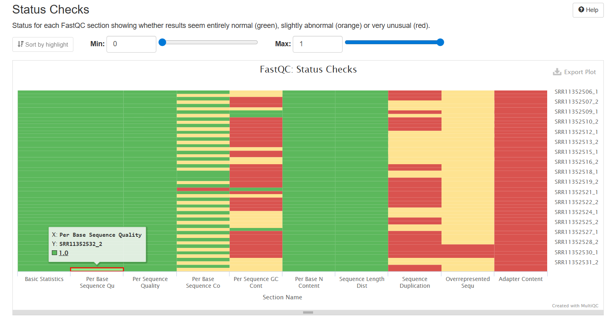
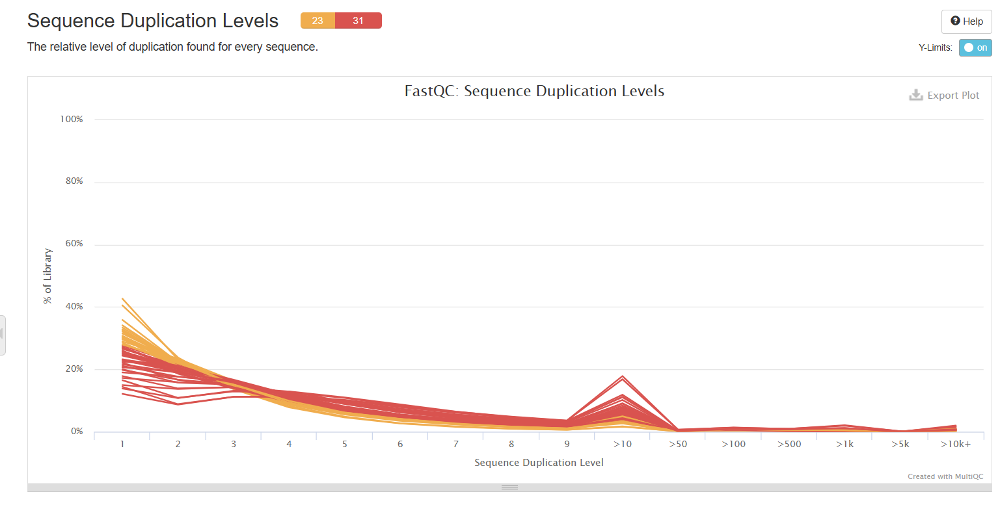
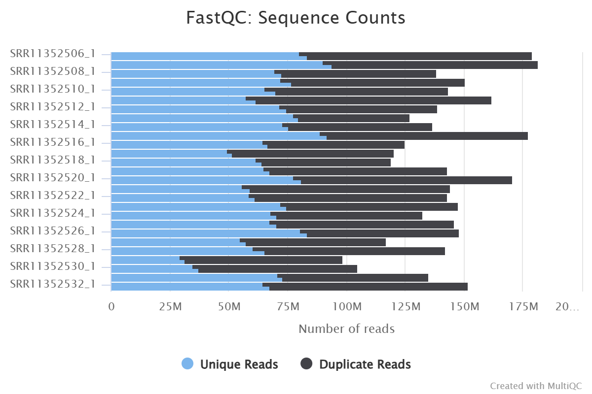
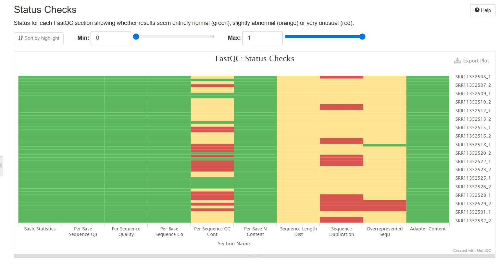
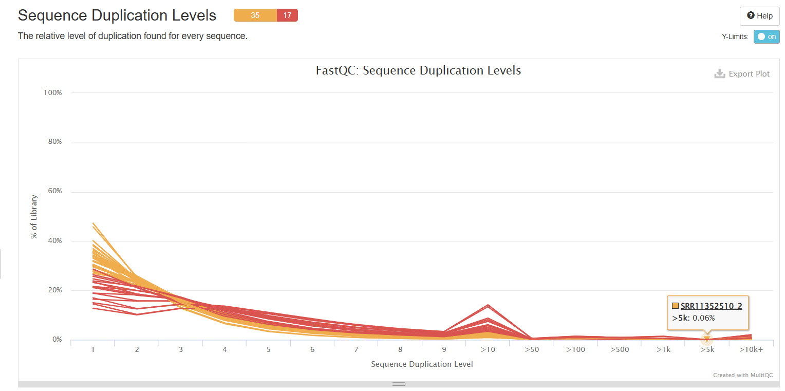
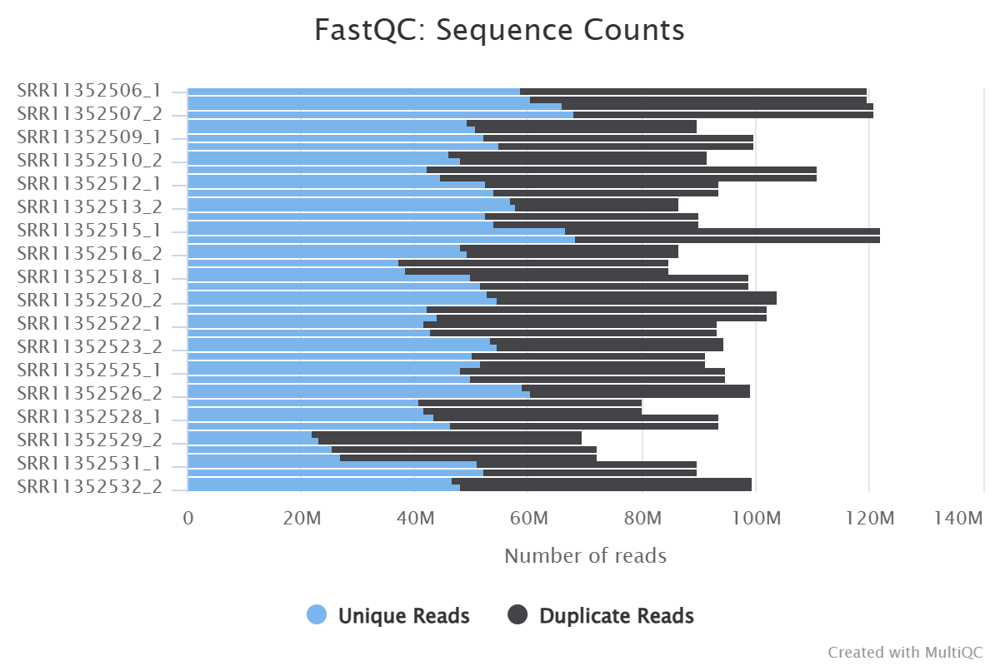

# Initial QC Summary: Canine Osteosarcoma WES Dataset (Das et al., 2021)

## Dataset and Project Background

Originally my project aimed to analyze somatic variants in a human glioblastoma dataset, however, that dataset required dbGaP access which I do not have. I was having a lot of trouble finding a human dataset so I switched to a canine dataset. The final dataset selected was from Das et al. (2021, *Communications Biology*), a whole exome sequencing study of canine osteosarcoma. Raw FASTQ files were obtained for 27 tumor samples (PRJNA613479; SRR11352506–SRR11352532) and 25 matched normal samples (PRJNA503860; SRR11392157–SRR11392182, excluding SRR11392176 which was not available in the repository), corresponding to the 26 tumor–normal pairs analyzed in Das et al. (2021). All samples are paired-end 151 bp reads, consistent with the Illumina HiSeq4000 sequencing described in the paper.

## Pipeline Challenges

A recurring challenge throughout the QC steps was the volume of samples. Given the number of samples, troubleshooting even small scripting errors was time-consuming, as each failed job required identifying the issue, correcting the script, and resubmitting.

## Raw Data QC

Pre-trimming FastQC results (54 files representing 27 tumor samples) revealed several consistent issues. All samples were uniform 151 bp reads. Duplication levels were elevated across the board, ranging from ~37% (SRR11352513) to ~70% (SRR11352529). The status check heatmap showed widespread warnings and failures in the Sequence Duplication, Overrepresented Sequences, and Per Base Sequence Content modules. Adapter content flags were present in 4 samples pre-trimming. Failure rates ranged from 10–40% per sample, with SRR11352529 and SRR11352530 showing the highest overall flags. GC content was consistent across samples (50–55%), which is expected for WES data. Raw read counts ranged from ~98M to ~181M reads per sample.

## Trimming

Trimmomatic was run in paired-end mode to remove adapter sequences and low-quality bases. One sample (SRR11352519) is absent from the trimmed FastQC results despite trimmed FASTQ files being present, likely due to a job submission error. FastQC will be rerun on this sample before proceeding to alignment.

## Post-Trimming QC

After trimming, the dataset was reduced to 52 files representing 26 tumor samples, pending reprocessing of SRR11352519. Adapter content warnings were eliminated entirely post-trimming (0 failures vs. 4 pre-trimming), confirming successful adapter removal. Per-base sequence quality scores remained high across all positions (Phred >30), and overrepresented sequence flags decreased substantially. Average read lengths remained near 151 bp (mean ~148 bp), indicating minimal over-trimming. Read counts were reduced modestly from raw, consistent with removal of low-quality reads. Duplication levels remained elevated post-trimming in several samples, notably SRR11352529 (~68%), SRR11352530 (~65%), SRR11352511 (~62%), SRR11352521 (~59%), and SRR11352522 (~55%). However, elevated duplication is an expected feature of WES data due to the capture step repeatedly enriching the same target regions, and these values are within a typical range for this library type. GC content was stable across all samples post-trimming (49–54%).

## Outstanding Issues

SRR11352519 is missing from trimmed FastQC results and will be reprocessed before alignment. All other 26 tumor samples passed trimming and post-trimming QC and are ready for alignment.

## References

Das, S., Idate, R., Regan, D.P., Fowles, J.S., Lana, S.E., Thamm, D.H., Gustafson, D.L., & Duval, D.L. (2021). Immune pathways and TP53 missense mutations are associated with longer survival in canine osteosarcoma. *Communications Biology*, 4, 1178. https://doi.org/10.1038/s42003-021-02683-0